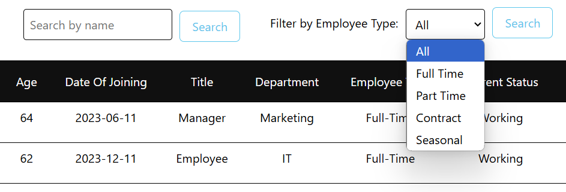
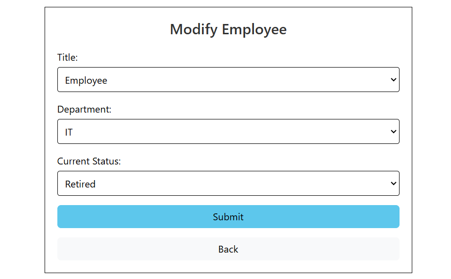
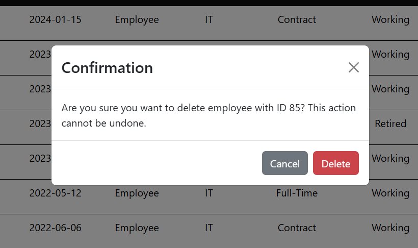
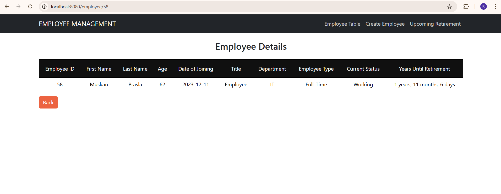
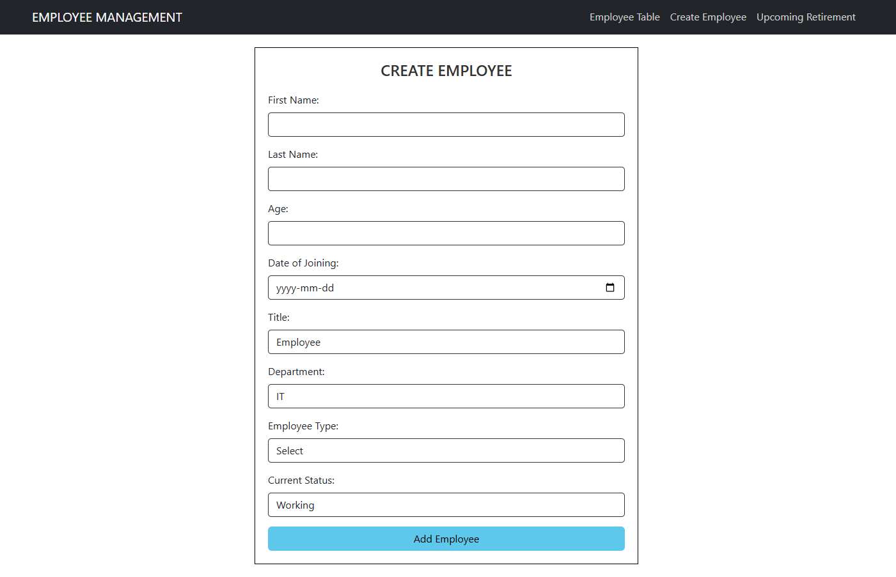
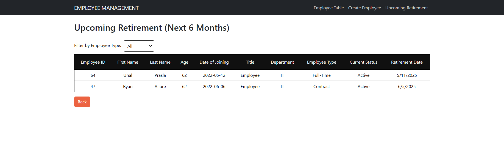

# Employee-Mangement

This application is an employee management system that allows administrators to view and manage employee details. It displays a list of employees and provides options to filter them by name or type, such as full-time, part-time, contract, or seasonal. There's also a form for adding new employees and a page where you can view detailed information about each employee, including how many years are left until their retirement. Additionally, it has a page that shows employees who will retire in the next 6 months.

The project is built using the MERN stack (MongoDB, Express, React, Node.js) and incorporates Bootstrap for styling. It uses class-based components to help familiarize with older technology that might still be in use in some companies.

1) List of Employees

2)Filter Employees

3)Modify existing employee details

4)Delete employee

5)Details of each employee including time left unti retirement

6)Add new employee

7)Employees that will retire in next 6 months
